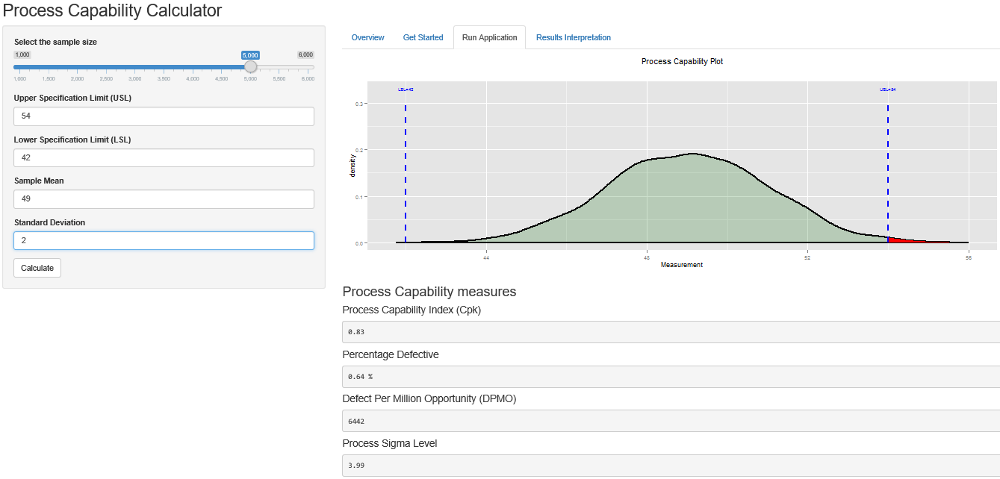

---
title       : Process Capability Calculator
subtitle    : A Shiny Application
author      : Mohammed K. Barakat
job         : 
framework   : io2012        # {io2012, html5slides, shower, dzslides, ...}
highlighter : highlight.js  # {highlight.js, prettify, highlight}
hitheme     : tomorrow      # 
widgets     : [mathjax,bootstrap]            # {mathjax, quiz, bootstrap}
mode        : selfcontained # {standalone, draft}
knit        : slidify::knit2slides
--- .class #id bg:#E3CEF6

## What is Process Capability?

* A way to measure the performance and capability of a process to meet customer specifications. It is represented by a normal distribution curve with upper and lower specification limits shown as vertical lines. 
* It is measured by the Process Capability Index (**Cpk**). The larger the Cpk, the more capable the process is. Cpk is calculated as the minimum between two values as represented in the formula:
$$\min{\left[\frac{\mbox{USL} - \mu} {3\sigma}, \frac{\mu - \mbox{LSL}} {3\sigma}\right]}$$

**Example**

Steel cylinders manufactured by a company should have their diameters-as specified by customers- between **42** and **54** mm. The current process produces cylinders with average diameter of **49** mm and **2**-mm standard deviation. What is the **Cpk** of this process?

--- .class #id bg:#A9F5E1

## Solution

*(Using R code)*


```r
usl=54
lsl=42
mn=49
std=2

cpu<-round((usl-mn)/(3*std),2) #upper Cp
cpl<-round((mn-lsl)/(3*std),2) #lower Cp
cpk=round(min(cpu,cpl),2)
cpk
```

```
## [1] 0.83
```

The Cpk of this process is **0.83** which is the minimum between Cp upper (**0.83**) and Cp lower (**1.17**).

--- bg:#81DAF5

## Use the Process Capability Calculator Application

By providing it with the Upper and Lower Specification Limits, mean, and standard deviation the application helps you calculate process capability index and other useful capability measures.

<div style='text-align: center;'>
    
</div>

--- .class #id bg:#F6D8CE

## Read more about Process Capability

(https://en.wikipedia.org/wiki/Process_capability)
(https://en.wikipedia.org/wiki/Process_capability_index)
(http://www.statisticaloutsourcingservices.com/Capability.pdf)

You can find the **server.R** and **ui.R** code files of the Process Capability Calculator application in github under this link:

(https://github.com/Mohammedkb/CpkCalculator)

Visit the **application** page at:

(https://mohdbarakat.shinyapps.io/CpkCal)
